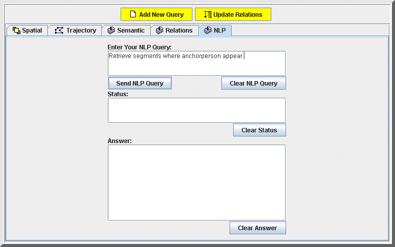
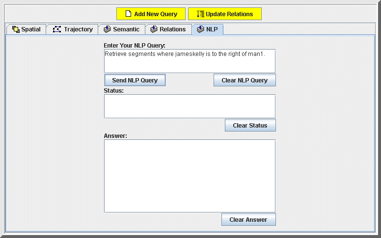



<h1>A Natural Language-Based Interface for Querying a Video Database</h1>

<i class="icon-user"></i> Onur Kucuktunc, Ugur Gudukbay, Ozgur Ulusoy

<strong><em>Abstract - </em></strong>
We have recently developed a video database system, BilVideo, which provides
integrated support for spatiotemporal, semantic, and low-level feature queries.
As a further development for this system, we present a natural language-based
interface for query specification. This natural language processing (NLP)-based
interface lets users formulate queries as sentences in English by using a
part-of-speech (POS) tagging algorithm. The system then groups the specified
queries as object-appearance, spatial, and similarity-based object trajectory 
queries by using POS tagging information.

<i class="icon-info-sign"></i> <a href="http://dx.doi.org/10.1109/MMUL.2007.1">10.1109/MMUL.2007.1</a> 
<i class="icon-file"></i> <a href="../../papers/journals/Kucuktunc-IEEE_Multimedia07.pdf">PDF</a> 
<i class="icon-tags"></i> NLP, POS, Video database, natural language querying, natural language processing, part-of-speech tagging algorithm, Database languages, Multimedia databases, natural language interfaces

O. Kucuktunc, U. Gudukbay, O. Ulusoy, <strong>A Natural Language-Based Interface for Querying a Video Database</strong>, <em>IEEE MultiMedia</em>, vol.14, no.1, pp. 83-89, Jan-Mar, 2007.

<h3>Supplementary Material</h3>
  
 

