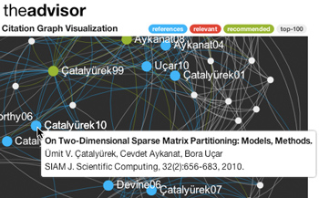



 <h2>Direction Awareness in Citation Recommendation </h2>

  Onur Kucuktunc, Erik Saule, Kamer Kaya, Umit V. Catalyurek

<strong><em>Abstract - </em></strong> 
Literature search is an important part of academic research. The
increase in the number of published papers each year makes manual
search inefficient, hence, automatic methods must be devised.
Unfortunately, traditional search engines use keyword-based
approaches to solve the search problem which are prone to ambiguity and
synonymity.
This paper focuses on the problem of extending a set of references
using the citation relations between the documents. In
particular, we introduce the class of <em>direction-aware</em>
algorithms which weight the importance of incoming 
and outgoing edges of the citation graph differently based on user
preferences. Using such an algorithm, the user can easily focus her
search toward recent developments or traditional papers.  We present
two direction-aware algorithms and show that they are better suited
at solving the problem at hand than state-of-the-art recommendation
methods.
One of these algorithms is currently deployed in a publicly available
web-service called the<strong>advisor</strong>.

  N/A 
  <a href="http://chenwsdb.fulton.ad.asu.edu/DBRank2012/dbrank-5.pdf">PDF</a> 
  literature search, graph, random walks, paper
recommendation, web service

O. Kucuktunc, E. Saule, K. Kaya, U.V. Catalyurek, <strong>Direction Awareness in Citation Recommendation</strong>, Proc. 6th International Workshop on Ranking in Databases (DBRank'12) in conjunction with VLDB'12, 2012.

<h3>Supplementary Material</h3>

the<strong>advisor</strong> is a graph-based citation, venue, and reviewer recommendation service developed by researchers of High Performance Computing Lab at The Ohio State University. 

 

<h2>Fast Recommendation on Bibliographic Networks </h2>

  Onur Kucuktunc, Kamer Kaya, Erik Saule, Umit V. Catalyurek

<strong><em>Abstract - </em></strong>
Graphs and matrices are widely used in algorithms for social network analyses.
Since the number of interactions is much less than the possible number of
interactions, the graphs and matrices used in the analyses are usually sparse.
In this paper, we propose an efficient implementation of a sparse-matrix
computation which arises in a publicly available citation recommendation service
called the<strong>advisor</strong>. The recommendation algorithm uses a sparse
matrix generated from the citation graph. We observed that the nonzero pattern
of this matrix is highly irregular and the computation suffers from high number
of cache misses. We propose techniques for storing the matrix in memory
efficiently and reducing the number of cache misses. Experimental results show
that our techniques are highly efficient on reducing the query processing time
which is highly crucial for a web service.

  <a href="http://dx.doi.org/10.1109/ASONAM.2012.82">10.1109/ASONAM.2012.82</a> 
  <a href="http://bmi.osu.edu/hpc/papers/Kucuktunc12-ASONAM.pdf">PDF</a> 
  citation recommendation, social network analysis, sparse matrices, hypergraphs, cache locality

O. Kucuktunc, K. Kaya, E. Saule, U.V. Catalyurek, <strong>Fast Recommendation on Bibliographic Networks</strong>, Proc. IEEE/ACM International Conference on Social Networks Analysis and Mining, 2012.

<h3>Supplementary Material</h3>

<h2>Recommendation on Academic Networks using Direction Aware Citation Analysis </h2>

  Onur Kucuktunc, Erik Saule, Kamer Kaya, Umit V. Catalyurek

<strong><em>Abstract - </em></strong>
The literature search has always been an important part of an academic
research. It greatly helps to improve the quality of the research
process and output, and increase the efficiency of the researchers in
terms of their novel contribution to science. As the number of published 
papers increases every year, a manual search becomes more exhaustive even 
with the help of today's search engines since they are not specialized for 
this task. In academics, two relevant papers do not always have to share 
keywords, cite one another, or even be in the same field. Although a 
well-known paper is usually an easy pray in such a hunt, relevant papers 
using a different terminology, especially recent ones, are not obvious to 
the eye. 

In this work, we propose paper recommendation algorithms by using the
citation information among papers. The proposed algorithms are <em>direction 
aware</em> in the sense that they can be tuned to find either
recent or traditional papers. The algorithms require a set of papers
as input and recommend a set of related ones. If the user wants to
give negative or positive feedback on the suggested paper set, the
recommendation is refined.  The search process can be easily guided in
that sense by relevance feedback.  We show that this slight guidance
helps the user to reach a desired paper in a more efficient way. We
adapt our models and algorithms also for the venue and reviewer
recommendation tasks. Accuracy of the models and algorithms is
thoroughly evaluated by comparison with multiple baselines and
algorithms from the literature in terms of several objectives specific
to citation, venue, and reviewer recommendation tasks. All of these
algorithms are implemented within a publicly available web-service
framework (<a href="http://theadvisor.osu.edu/">the<strong>advisor</strong></a>)
which currently uses the data from <a href="http://dblp.uni-trier.de">DBLP</a>
and <a href="http://citeseer.ist.psu.edu/">CiteSeer</a> to construct the
proposed citation graph.

  <a href="http://arxiv.org/abs/1205.1143">arXiv:1205.1143</a> 
  <a href="http://arxiv.org/pdf/1205.1143v1">PDF</a> 
  literature search, graph, random walks, paper
recommendation, web service

O. Kucuktunc, E. Saule, K. Kaya, U.V. Catalyurek, <strong>Recommendation on Academic Networks using Direction Aware Citation Analysis</strong>, <em>Technical Report</em>, Available at http://arxiv.org/abs/1205.1143

<h3>Supplementary Material</h3>

