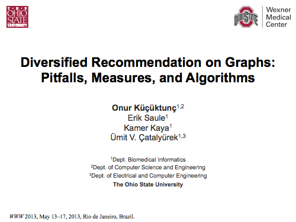
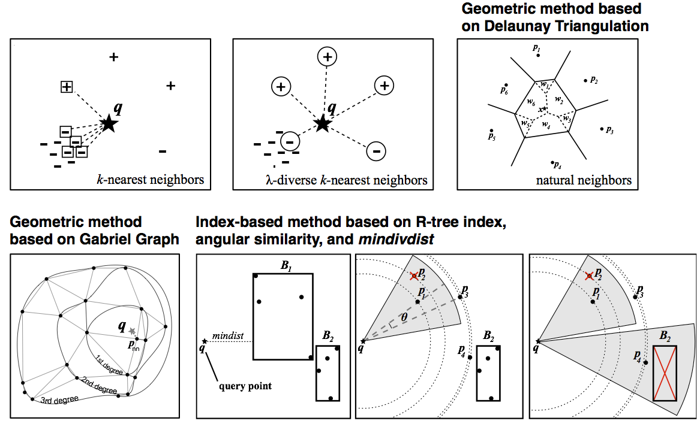



<h2>Diversified Recommendation on Graphs: Pitfalls, Measures, and Algorithms</h2>

  Onur Kucuktunc, Erik Saule, Kamer Kaya, Umit V. Catalyurek

<strong><em>Abstract - </em></strong>
Result diversification has gained a lot of attention as a way to
answer ambiguous queries and to tackle the redundancy problem in the
results.  In the last decade, diversification has been applied on or
integrated into the process of PageRank- or eigenvector-based methods
that run on various graphs, including social networks, collaboration
networks in academia, web and product co-purchasing graphs. For these
applications, the diversification problem is usually addressed as a
bicriteria objective optimization problem of relevance and
diversity. However, such an approach is questionable since a
<em>query-oblivious</em> diversification algorithm that recommends most
of its results without even considering the query may perform the best
on these commonly used measures. In this paper, we show the
deficiencies of popular evaluation techniques of diversification
methods, and investigate multiple relevance and diversity measures to
understand whether they have any correlations. Next, we propose a
novel measure called <strong>expanded relevance</strong> which combines both
relevance and diversity into a single function in order to measure the
coverage of the relevant part of the graph. We also present a new
greedy diversification algorithm called <strong>BestCoverage</strong>, which optimizes the
<em>expanded relevance</em> of the result set with
(1-1/e)-approximation. With a rigorous experimentation on graphs
from various applications, we show that the proposed method is
efficient and effective for many use cases.

   
  <a href="http://www.cse.ohio-state.edu/~kucuktun/papers/Kucuktunc13-WWW.pdf">PDF</a> 
  diversity, relevance, graph mining, result diversification

O. Kucuktunc, E. Saule, K. Kaya, U.V. Catalyurek, <strong>Diversified Recommendation on Graphs: Pitfalls, Measures, and Algorithms</strong>, In <em>Proc. 22nd International World Wide Web Conference (WWW'13)</em>, May, 2013.

<h3>Supplementary Material</h3>
Set of slides used in the presentation. 

<h2>&lambda;-Diverse Nearest Neighbors Browsing for Multi-dimensional Data</h2>

  Onur Kucuktunc, Hakan Ferhatosmanoglu

<strong><em>Abstract - </em></strong>
Traditional search methods try to obtain the most relevant information and rank
it according to the degree of similarity to the queries. Diversity in query
results is also preferred by a variety of applications since results very
similar to each other cannot capture all aspects of the queried topic. In this
work, we focus on the &lambda;-diverse k-nearest neighbor search problem on
spatial and multi-dimensional data. Unlike the approach of diversifying query
results in a post-processing step, we naturally obtain diverse results with the
proposed geometric and index-based methods. We first make an analogy with the
concept of natural neighbors and propose a natural neighbor-based method for 2D
and 3D data and an incremental browsing algorithm based on Gabriel graphs for
higher dimensional spaces. We then introduce a diverse browsing method based on
the distance browsing feature of spatial index structures, such as R-trees. The
algorithm maintains a priority queue with mindivdist of the objects depending on
both relevancy and angular diversity and efficiently prunes non-diverse items
and nodes. We experimented with a number of spatial and high-dimensional
datasets, including Factual's US points-of-interest dataset with 13M entries.
With effective pruning, our diverse browsing method is shown to be more
efficient and more effective than KNN and KNDN techniques.

  <a href="http://dx.doi.org/10.1109/TKDE.2011.251">10.1109/TKDE.2011.251</a> 
  <a href="http://www.cse.ohio-state.edu/~kucuktun/papers/Kucuktunc_TKDE12.pdf">PDF</a> 
  indexes, nearest neighbor searches, search problems, spatial databases

O. Kucuktunc, H. Ferhatosmanoglu, <strong>&lambda;-Diverse Nearest Neighbors Browsing for Multi-dimensional Data</strong>, <em>IEEE Transactions on Knowledge and Data Engineering</em>, vol. 25, no. 3, pp. 481-493, Mar, 2013.

<h3>Supplementary Material</h3>
Teaser image prepared for IEEEXplore. 

