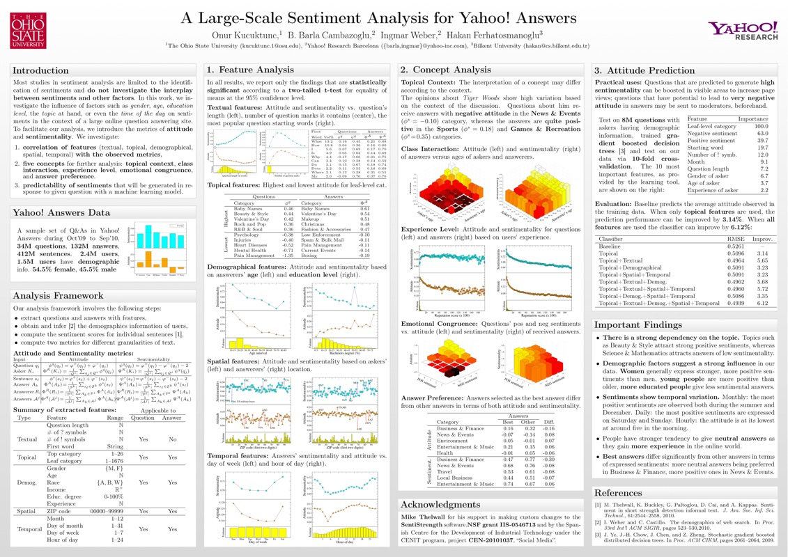
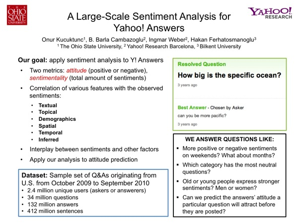
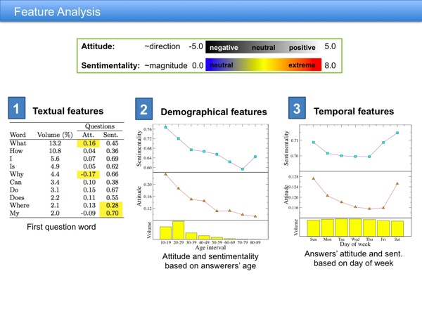
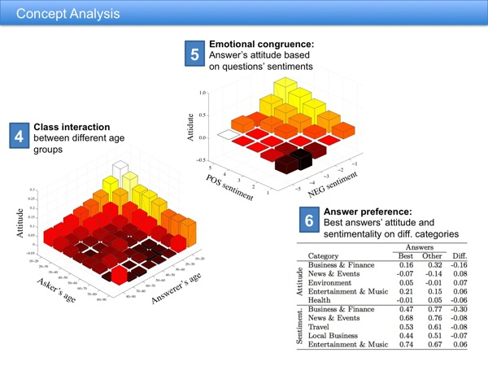



<h2>A large-scale sentiment analysis for Yahoo! Answers</h2>

  Onur Kucuktunc, B. Barla Cambazoglu, Ingmar Weber, Hakan Ferhatosmanoglu

<strong><em>Abstract - </em></strong>
Sentiment extraction from online web documents has recently been an active
research topic due to its potential use in commercial applications. By sentiment
analysis, we refer to the problem of assigning a quantitative positive/negative
mood to a short bit of text. Most studies in this area are limited to the
identification of sentiments and do not investigate the interplay between
sentiments and other factors. In this work, we use a sentiment extraction tool
to investigate the influence of factors such as gender, age, education level,
the topic at hand, or even the time of the day on sentiments in the context of a
large online question answering site. We start our analysis by looking at direct
correlations, e.g., we observe more positive sentiments on weekends, very
neutral ones in the Science &amp; Mathematics topic, a trend for younger people to
express stronger sentiments, or people in military bases to ask the most neutral
questions. We then extend this basic analysis by investigating how properties of
the (asker, answerer) pair affect the sentiment present in the answer. Among
other things, we observe a dependence on the pairing of some inferred attributes
estimated by a user's ZIP code. We also show that the best answers differ in
their sentiments from other answers, e.g., in the Business &amp; Finance topic, best
answers tend to have a more neutral sentiment than other answers. Finally, we
report results for the task of predicting the attitude that a question will
provoke in answers. We believe that understanding factors influencing the mood
of users is not only interesting from a sociological point of view, but also has
applications in advertising, recommendation, and search.

  <a href="http://dx.doi.org/10.1145/2124295.2124371">10.1145/2124295.2124371</a> 
  <a href="http://www.cse.ohio-state.edu/~kucuktun/papers/Kucuktunc-WSDM12.pdf">PDF</a> 
  attitude, collaborative question answering, prediction, psychology, sentiment analysis, sentimentality, sociology

O. Kucuktunc, B.B. Cambazoglu, I. Weber, H. Ferhatosmanoglu, <strong>A Large-Scale Sentiment Analysis for Yahoo! Answers</strong>, <em>Proceedings of the fifth ACM international conference on Web search and data mining</em> (WSDM '12). ACM, New York, NY, USA, 633-642. (acceptance rate 20.7%).

<h3>Supplementary Material</h3>
Poster version of the full-paper.
  

Slides of the spotlight presentation.
 
 
 

