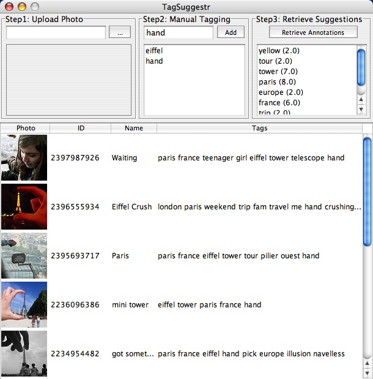
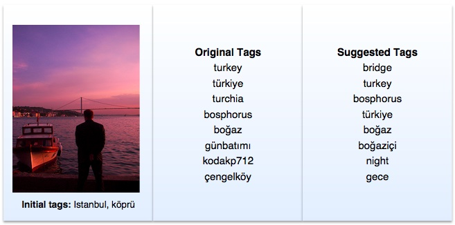
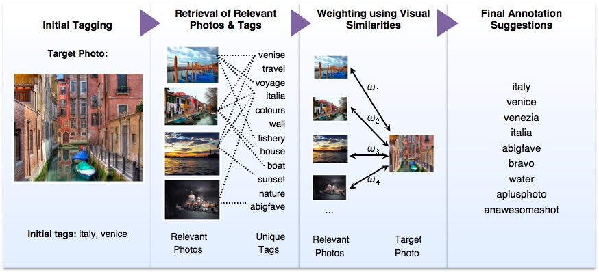
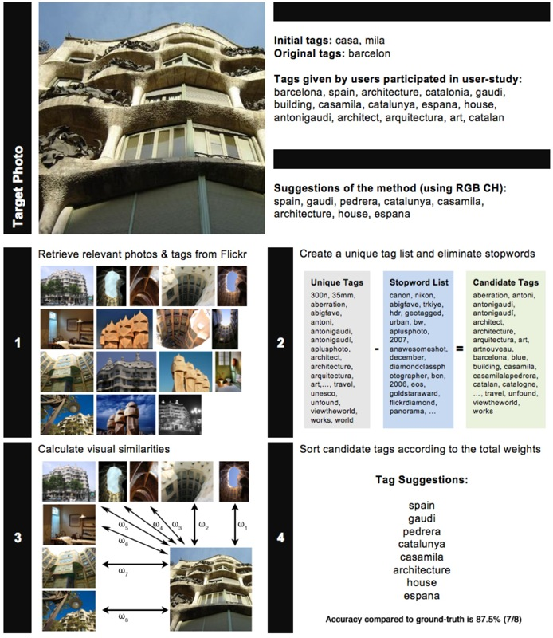



<h1>Automatic Tag Expansion using Visual Similarity for Photo Sharing Websites</h1>

<i class="icon-user"></i> Sare Gul Sevil, Onur Kucuktunc, Pinar Duygulu, Fazli Can

<strong><em>Abstract - </em></strong>
In this paper we present an automatic photo tag expansion method designed for
photo sharing websites. The purpose of the method is to suggest tags that are
relevant to the visual content of a given photo at upload time. Both textual and
visual cues are used in the process of tag expansion. When a photo is to be
uploaded, the system asks for a couple of initial tags from the user. The
initial tags are used to retrieve relevant photos together with their tags.
These photos are assumed to be potentially content related to the uploaded
target photo. The tag sets of the relevant photos are used to form the
candidate tag list, and visual similarities between the target photo and
relevant photos are used to give weights to these candidate tags. Tags with the
highest weights are suggested to the user. The method is applied on Flickr
(<a href="http://www.flickr.com">http://www.flickr.com</a>). Results show that
including visual information in the process of photo tagging increases accuracy
with respect to text-based methods.

<i class="icon-info-sign"></i> <a href="http://dx.doi.org/10.1007/s11042-009-0394-5">10.1007/s11042-009-0394-5</a> 
<i class="icon-file"></i> <a href="../../papers/journals/Sevil-MTAP10.pdf">PDF</a> 
<i class="icon-tags"></i> flickr, folksonomy, photo annotation, tagging, visual similarity

S.G. Sevil, Onur Kucuktunc, P. Duygulu, F. Can, <strong>Automatic Tag Expansion using Visual Similarity for Photo Sharing Websites</strong>, <em>Multimedia Tools and Applications</em>, vol.49, no.1, pp. 81-99, Aug, 2010.

<h1>Tag Suggestr: Automatic Photo Tag Expansion using Visual Information for Photo Sharing Websites</h1>

<i class="icon-user"></i> Onur Kucuktunc, Sare Gul Sevil, Akif Burak Tosun, Onur Kucuktunc, Pinar Duygulu, Fazli Can

<strong><em>Abstract - </em></strong>
In this paper, we propose an automatic photo tag expansion system for the
community photo collections, such as Flickr. Our aim is to suggest relevant tags
for a target photograph uploaded to the system by a user, by incorporating the
visual and textual cues from other related photographs. As the first step, the
system requires the user to add only a few initial tags for each uploaded photo.
These initial tags are used to retrieve related photos including the same tags
in their tag lists. Then the set of candidate tags collected from a large pool
of photos is weighted according to the similarity of the target photo to the
retrieved photo including the tag. Finally, the tags in the highest rankings are
used to automatically expand the tags of the target photo. The experimental
results on Flickr photos show that, the use of visual similarity of semantically
relevant photos to recommend tags improves the quality of suggested tags
compared to only text-based systems.

<i class="icon-info-sign"></i> <a href="http://dx.doi.org/10.1007/978-3-540-92235-3_7">10.1007/978-3-540-92235-3_7</a> 
<i class="icon-file"></i> <a href="../../papers/proceedings/Kucuktunc-SAMT08.pdf">PDF</a> 
<i class="icon-tags"></i> flickr, folksonomy, photo annotation, tagging, visual similarity

O. Kucuktunc, S.G. Sevil, A.B. Tosun, H. Zitouni, P. Duygulu, F. Can, <strong>Tag Suggestr: Automatic Photo Tag Expansion using Visual Information for Photo Sharing Websites</strong>, <em>Proceedings of 3rd International Conference on Semantic and Digital Media Technologies</em> (SAMT 2008), Koblenz, Germany, December 3-5, 2008. Lecture Notes in Computer Science, vol.5392/2008, Springer Verlag, Berlin Heidelberg, pp.63-71, 2008.

<h3>Supplementary Material</h3>
  
  
  
 

