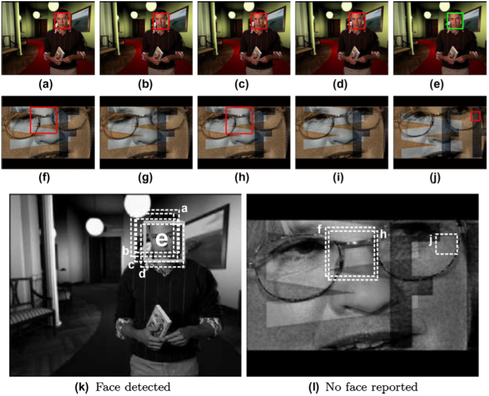
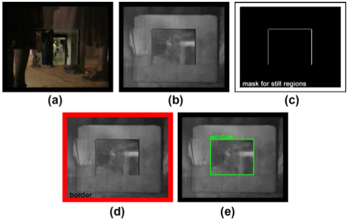
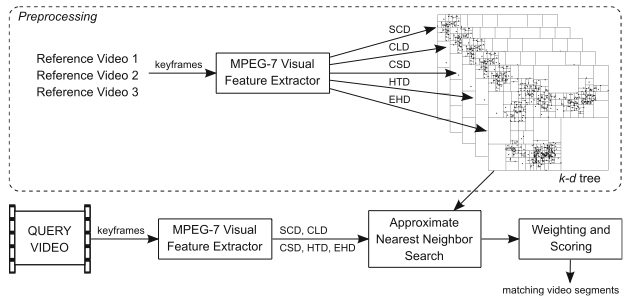



<h1>Video Copy Detection Using Multiple Visual Cues and MPEG-7 Descriptors</h1>

<i class="icon-user"></i> Onur Kucuktunc, Muhammet Bastan, Ugur Gudukbay, Ozgur Ulusoy

<strong><em>Abstract - </em></strong>
We propose a video copy detection framework that detects copy segments by fusing
the results of three different techniques: facial shot matching, activity
subsequence matching, and non-facial shot matching using low-level features. In
facial shot matching part, a high-level face detector identifies facial
frames/shots in a video clip. Matching faces with extended body regions gives
the flexibility to discriminate the same person (e.g., an anchor man or a
political leader) in different events or scenes. In activity subsequence
matching part, a spatio-temporal sequence matching technique is employed to
match video clips/segments that are similar in terms of activity. Lastly, the
non-facial shots are matched using low-level MPEG-7 descriptors and
dynamic-weighted feature similarity calculation. The proposed framework is
tested on the query and reference dataset of CBCD task of TRECVID 2008. Our
results are compared with the results of top-8 most successful techniques
submitted to this task. Promising results are obtained in terms of both
effectiveness and efficiency.

<i class="icon-info-sign"></i> <a href="http://dx.doi.org/10.1016/j.jvcir.2010.07.001">10.1016/j.jvcir.2010.07.001</a> 
<i class="icon-file"></i> <a href="../../papers/journals/Kucuktunc-JVCIR10.pdf">PDF</a> 
<i class="icon-tags"></i> activity matching, content-based copy detection, face detection, mpeg-7, subsequence matching, time series analysis, video copy detection, visual ques

O. Kucuktunc, M. Bastan, U. Gudukbay, O. Ulusoy, <strong>Video Copy Detection Using Multiple Visual Cues and MPEG-7 Descriptors</strong>, <em>Journal of Visual Communication and Image Representation</em>, vol.21, no.8, pp.838-849, Nov, 2010.

<h1>Fuzzy Color Histogram-based Video Segmentation</h1>

<i class="icon-user"></i> Onur Kucuktunc, Ugur Gudukbay, Ozgur Ulusoy

<strong><em>Abstract - </em></strong>
We present a fuzzy color histogram-based shot-boundary detection algorithm
specialized for content-based copy detection applications. The proposed method
aims to detect both cuts and gradual transitions (fade, dissolve) effectively in
videos where heavy transformations (such as cam-cording, insertions of patterns,
strong re-encoding) occur. Along with the color histogram generated with the
fuzzy linking method on L*a*b* color space, the system extracts a mask for still
regions and the window of picture-in-picture transformation for each detected
shot, which will be useful in a content-based copy detection system.
Experimental results show that our method effectively detects shot boundaries
and reduces false alarms as compared to the state-of-the-art shot-boundary
detection algorithms.

<i class="icon-info-sign"></i> <a href="http://dx.doi.org/10.1016/j.cviu.2009.09.008">10.1016/j.cviu.2009.09.008</a> 
<i class="icon-file"></i> <a href="../../papers/journals/Kucuktunc-CVIU10.pdf">PDF</a> 
<i class="icon-tags"></i> content-based copy detection, cut/gradual transition, fuzzy color histogram, shot boundary detection, video analysis, video segmentation

Onur Kucuktunc, U. Gudukbay, O. Ulusoy, <strong>Fuzzy Color Histogram-based Video Segmentation</strong>, <em>Computer Vision and Image Understanding</em>, vol.114, no.1, pp.125-134, Jan, 2010.

<h3>Supplementary Material</h3>
<iframe width="300" height="250" src="http://www.youtube.com/embed/KbqsGIYhB6M?theme=light" frameborder="0" allowfullscreen></iframe>
  
  
 

